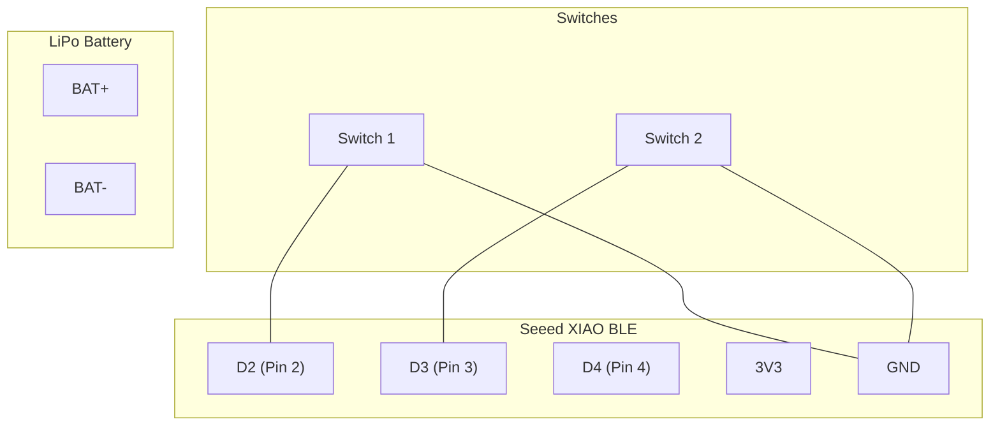
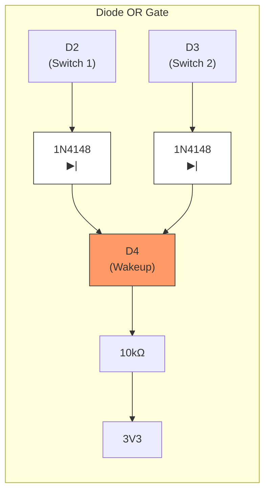

A battery-efficient dual switch using nRF52 that broadcasts both switch states via BTHome. Uses a shared wakeup pin so either switch can wake the device from deep sleep.

## Hardware

- Seeed XIAO BLE (nRF52840)
- 2x Toggle switches or rocker switches
- 2x 1N4148 diodes (for wakeup OR circuit)
- 3.7V LiPo battery

## Wiring

| Component | XIAO Pin |
|-----------|----------|
| Switch 1 | D2 → GND |
| Switch 2 | D3 → GND |
| Wakeup (combined) | D4 |
| Battery+ | BAT+ |
| Battery- | BAT- |

### Wiring Diagram



### Wakeup Circuit

Wire both switch outputs to the wakeup pin using diodes to create an OR gate:



When either switch is pressed (pulls to GND), D4 goes LOW and wakes the device.

## Configuration

```yaml
esphome:
  name: switch-2gang
  friendly_name: 2-Gang Switch

nrf52:
  board: xiao_ble
  bootloader: adafruit

logger:

external_components:
  - source:
      type: git
      url: https://github.com/dz0ny/esphome-bthome
      ref: main
    components: [bthome]

# Battery monitoring
sensor:
  - platform: adc
    pin: 29
    id: battery_voltage
    name: "Battery Voltage"
    update_interval: 60s
    filters:
      - multiply: 2.0

  - platform: template
    id: battery_percent
    name: "Battery"
    unit_of_measurement: "%"
    lambda: |-
      float voltage = id(battery_voltage).state;
      float percent = (voltage - 3.0) / (4.2 - 3.0) * 100.0;
      if (percent > 100) percent = 100;
      if (percent < 0) percent = 0;
      return percent;
    update_interval: 60s

# Switches on separate pins for individual state reading
binary_sensor:
  - platform: gpio
    pin:
      number: 2
      mode: INPUT_PULLUP
    id: switch_1
    name: "Switch 1"
    filters:
      - invert:
      - delayed_on: 10ms
      - delayed_off: 10ms

  - platform: gpio
    pin:
      number: 3
      mode: INPUT_PULLUP
    id: switch_2
    name: "Switch 2"
    filters:
      - invert:
      - delayed_on: 10ms
      - delayed_off: 10ms

# BTHome broadcast
bthome:
  min_interval: 5s
  max_interval: 30s
  tx_power: 4
  sensors:
    - type: battery
      id: battery_percent
  binary_sensors:
    - type: generic_boolean
      id: switch_1
      advertise_immediately: true
    - type: generic_boolean
      id: switch_2
      advertise_immediately: true

# Deep sleep - wake on either switch via combined wakeup pin
deep_sleep:
  run_duration: 15s
  sleep_duration: 5min
  wakeup_pin:
    number: 4
    mode: INPUT_PULLUP
    inverted: true
```

## How It Works

1. **Normal operation**: Device sleeps, both switches readable on D2/D3
2. **Either switch pressed**: D4 goes LOW via diode OR circuit
3. **Device wakes**: Reads individual switch states from D2 and D3
4. **Broadcasts**: Sends both switch states via BTHome
5. **Returns to sleep**: After `run_duration` expires

## Power Consumption

| State | Current |
|-------|---------|
| Deep sleep | ~3µA |
| Active | ~5mA |

**Expected battery life**: 6-12 months with 400mAh battery
